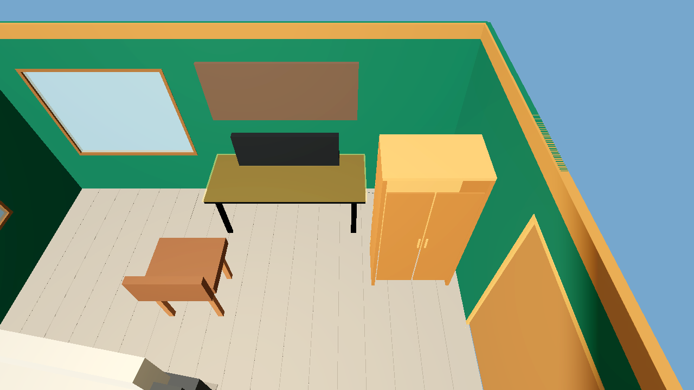
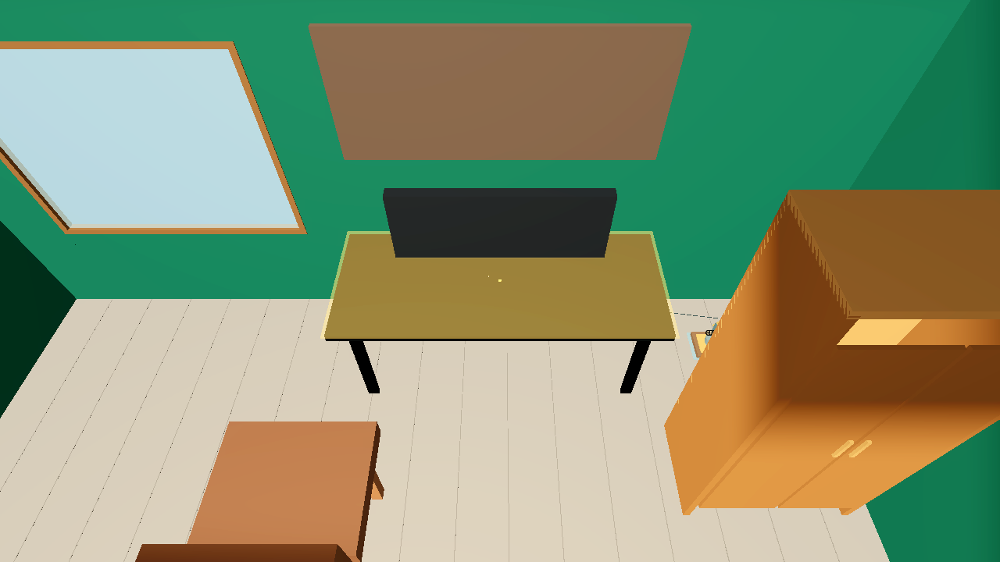

# RoomScale POC 2 Improvements

POC 2 adds a repeatable path from ordinary room photos to a playable RoomScale candidate. The candidate is stored as standard `RoomDefinition` data; the renderer, navigation, and gameplay consume that data through shared code.

## What changed

| Area | Improvement | Why it matters |
| --- | --- | --- |
| Photo reconstruction | Added a packaged room-reconstruction skill with references for photo interpretation, uncertainty notes, the output contract, and validator-guided repair. The workflow accepts variable photo counts and does not require a known measurement. | A new run can produce an inspectable candidate JSON and explain which geometry is estimated or obscured. |
| Room data and rendering | Extended `RoomDefinition` with a version 2 room shell, wall-local openings, appearance data, and optional trim, while keeping version 1 Room A and Room B support. | Photo-derived room colors, doors, windows, and object appearances can render through generic code. |
| Geometry and navigation | Added validation for room-shell/opening values and rotated object bounds, plus derived floor blockers, elevated approaches, and construction-site checks. | Candidates are checked for navigable geometry before being used in gameplay. |
| Runtime workflow | Generalized the runner and test harness to accept a safe project-local candidate JSON path. Existing tasks use the candidate data without room-specific gameplay branches. | A reconstructed room can use the existing simulation and gameplay loop without hand-authoring a Godot level. |

Implementation details are in the [RoomDefinition contract](RoomDefinition_Contract.md) and the packaged [reconstruction skill](../skills/roomscale-room-reconstruction/SKILL.md).

## Screenshots

These are saved captures of the canonical photo-derived candidate. The first is the whole-room initial runtime view; the other two are clean M5 visual captures without the HUD.

### Whole-room runtime view

The open-top view shows the approximate shell and the major furniture layout in the runtime. The HUD is visible, and it covers part of the room.

### Reconstructed shell and openings

This clean view shows the green shell, wood trim, window, doorway, desk, chair, and cabinet represented in the candidate.

### Workstation and storage detail

This closer view makes the desk, chair, window, and cabinet easier to inspect. It also shows the scale and simplified appearance of the rendered furniture.

## Verification and limits

- The canonical photo-derived candidate passed structural and runtime-navigation validation and the production gameplay run through milestones M2–M6 and M8. See the [M5 visual report](../verification/poc2/m5-status.md) and [acceptance matrix](../verification/poc2/acceptance-matrix.md).
- A fresh reconstruction context used exactly two canonical photos, no supplied scale measurement, and no earlier candidate or run artifacts. After one validator-directed repair, its candidate passed structural and runtime-navigation validation. That run verifies reconstruction workflow portability, not gameplay completion; see the [fresh-context report](../verification/poc2/fresh-luna-final/final-report.md).
- The captures show a recognizable, stylized approximation. They do not demonstrate exact dimensions or photo-realism. The small citizens and cable are difficult to see, and the open-top view does not clearly show the ceiling color.
- Two acceptance criteria remain open: AC-8's actionable request for another photo is documented but its request branch was not exercised; AC-48's clean-clone check used the canonical room, so its cross-room portability criterion remains partial. POC 2 is not declared complete in the [acceptance matrix](../verification/poc2/acceptance-matrix.md).
