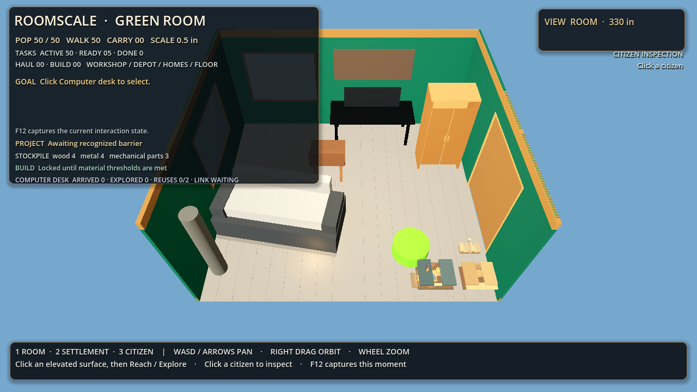
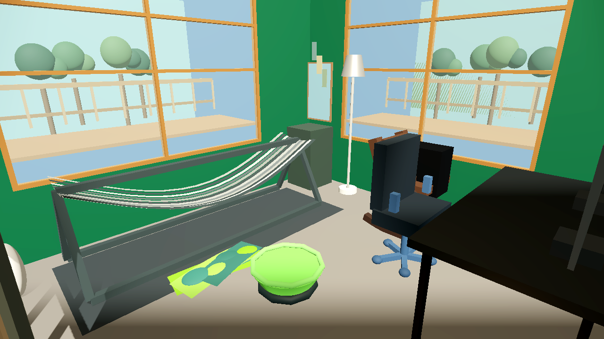
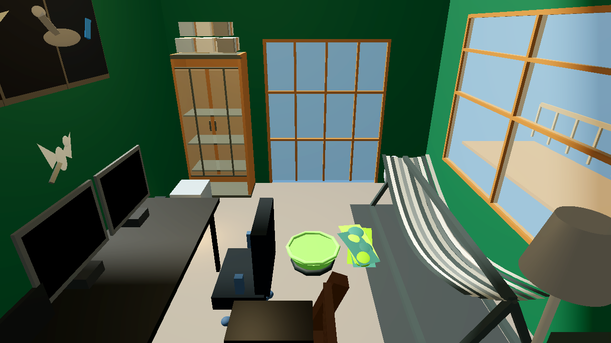
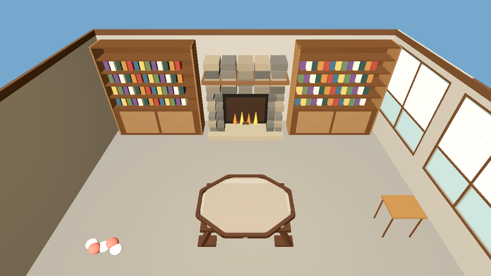

# RoomScale POC 2 improvements and current review

POC 2 adds a photo-to-`RoomDefinition` workflow. A multimodal AI uses the packaged reconstruction skill to produce ordinary repository data; the validator and shared simulation then consume that data. The game does not call a reconstruction model at runtime.

## Implemented workflow

- The packaged [room reconstruction skill](../skills/roomscale-room-reconstruction/SKILL.md) describes photo interpretation, uncertainty, schema authoring, validation, and repair.
- Schema v2 carries generic shell, opening, color, material, transparency, and archetype descriptions. Room A and Room B remain supported by shared code.
- The validator checks the room and its derived navigation. The production harness can load a project-local candidate JSON.
- The current renderer revision adds dedicated generic geometry for hammocks, divided and shaded windows, glazed doors, book-filled built-ins, stone fireplaces, octagonal glass tables, and several other common forms. Wood frames remain opaque when adjacent glass uses transparency.

## Primary photo-alignment revisions

Attempt 6 and the newer attempt 7 are preserved under `verification/poc2/candidates/primary/`. The photo-derived layout includes the deep-green shell, adjoining divided windows, hammock and stand, workstation, storage cabinet, French doors, rocking chair, saucer seat, and wall art. Attempt 7 adjusts the carpet and oak-trim palette, increases glazing transparency, corrects the wall-art orientation, and adds a generic deck, rail, and foliage backdrop behind windows. The previous candidate and original photos remain intact.

The captures show the prior overview and attempt-7 visual revision:

| Earlier overview | Attempt-7 window/hammock | Attempt-7 doors/layout |
| --- | --- | --- |
|  |  |  |

The images use different camera framing, so they illustrate changes rather than provide a pixel-aligned comparison. Attempt 7 improves the palette, window visibility, and broad furniture grouping, but it remains a stylized procedural render with estimated dimensions, simple shapes and materials, and simplified artwork. The user has now reviewed attempt 7, said it looks much better, and accepted it for current tests. AC-18, AC-19, and AC-44 are accepted at that scope. Closer visual resemblance remains a future graphics improvement, not a current test blocker.

Attempt 6's original production log ends after traversal without completion markers or a failure diagnostic. A deliberate rerun of attempt 6 passed the full M2/M3/M4/M5/M6/M8 harness; attempt 7 also passed that full harness. The attempt-7 evidence is `verification/poc2/candidates/primary/attempt-7/production-full.log`, alongside its validator, fast-suite log, and three rendered views.

## Second-room generalization check

Four photos in `photo_holder/second_room/` show a different living room. A separate candidate represents the fireplace and built-ins, two shaded window groups, a glazed door, the octagonal coffee table, carpet, sofa, cushions, and opposite-wall artwork. Temporary moving boxes are omitted.

The render captures are saved in the screenshot folder:

- [Fireplace and built-ins](../screenshots/poc2/second-room-hearth-and-builtins.png)
- [Coffee-table detail](../screenshots/poc2/second-room-coffee-table-detail.png)
- [Shaded windows and sliding door](../screenshots/poc2/second-room-shaded-windows-and-slider.png)
- [Opposite wall and sofa](../screenshots/poc2/second-room-opposite-wall-and-sofa.png)

The candidate passes structural and runtime-navigation validation with six generated obstacles, four reachable target approaches, and a reachable derived construction site. It also passes the full M2/M3/M4/M5/M6/M8 gameplay harness with the coffee table as its elevated target; the saved production log is `verification/poc2/candidates/secondary-room/production-full.log`. The same candidate passes those steps from a clean clone; see [the clone record and logs](../verification/poc2/clean-clone-secondary-room/README.md). That earlier candidate was authored in the continuing project context and remains preserved as historical evidence; the separate fresh-context AC-48 run is recorded below.

### Fresh-context AC-48 result

A separate clone was created at `C:\Users\Zero\AppData\Local\Temp\roomscale-ac48-fresh-context-20260928`, commit `2dda51b979850794a5f1d292705d37bb51756b02`. Its `git status --short` was empty before inputs. The only room-specific inputs added were the four ordinary photos from `photo_holder/second_room/`. This fresh context used the clone's README, reconstruction skill and its references, `docs/RoomDefinition_Contract.md`, and those photos; it did not use any earlier second-room candidate, note, capture, or log.

The new `room_hearth_living_room_fresh.json` and untouched attempt 1 are saved with the reconstruction note, provenance, both validator logs, and `gameplay.log` under `verification/poc2/candidates/secondary-room/fresh-context/`. Attempt 1 passed without repair: structural and runtime-navigation validation passed with seven blockers, four reachable target approaches, and a valid derived construction site. The full production run used the required 360-second timeout, exited 0, and recorded M2, M3, M4, M5, M6, and M8 PASS markers. No renderer or gameplay source files changed. AC-48 is resolved.
## Verification and open acceptance

- `TEST_ROOM_SCALE_FAST.ps1` passes for Room A, Room B, schema v2, malformed inputs, derived obstacles, and navigation. Godot emits existing leaked-resource warnings at shutdown after the explicit pass marker.
- `room_hearth_living_room.json` passes `VALIDATE_ROOM_SCALE.ps1` and the full gameplay harness; the four second-room runtime screenshots were captured at 1280×720.
- The primary attempt-7 candidate passes validation, the fast suite, and the full M2/M3/M4/M5/M6/M8 gameplay harness; its captures are in `screenshots/poc2/`.
- The historical attempt-2 and the attempt-6 rerun also support a complete primary-room gameplay loop. The original attempt-6 log remains preserved as incomplete.
- AC-8 has a specific optional follow-up-photo request: a wide, level reverse view from the fireplace side to show the far corners, opposite wall, and glass-door/entry connection. The current four photos remain enough to continue.
- The user accepts primary attempt 7 for current tests; closer visual resemblance is deferred. The fresh-context secondary-room candidate validates and passes full gameplay, resolving AC-48. See its [candidate and evidence](../verification/poc2/candidates/secondary-room/fresh-context/) and the complete [acceptance matrix](../verification/poc2/acceptance-matrix.md).

The fresh-context AC-48 run closes POC 2's last formal evidence item: the candidate was authored from a clean clone's skill/references and the four second-room photos, then passed validation and the full production gameplay run. Its provenance and all attempt/log artifacts are saved with the candidate. Primary attempt 7 remains accepted for current tests; closer resemblance to the photographs is future graphics work.
